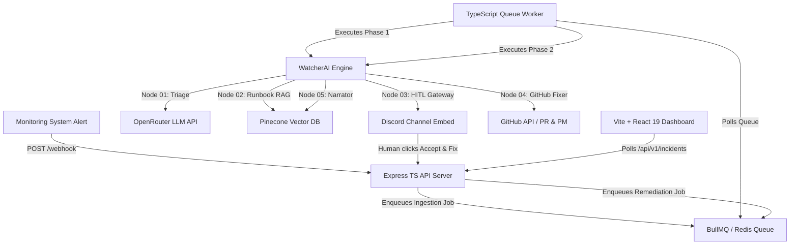
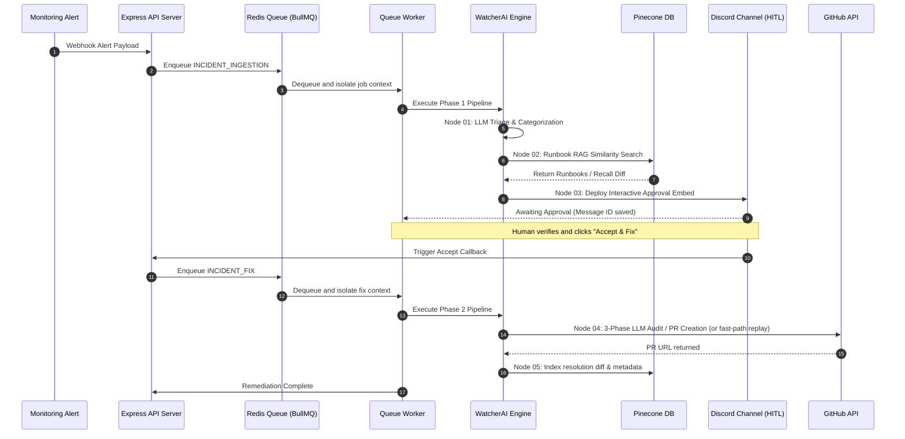

# 🛡️ WatcherAgent

> **AI-governed incident response that triages, notifies, fixes, and learns — autonomously.**

WatcherAgent is a state-of-the-art, production-grade, multi-node agentic incident response and self-healing orchestration platform. By coupling deterministic telemetry parsing with advanced LLM-guided auditing and semantic vector memory, WatcherAgent automates the entire lifecycle of production incidents. When an alert fires, WatcherAgent instantly triages the error, retrieves historical remediations, negotiates developer approval through interactive Discord notifications, commits a verified git patch, and indexes the resolution in a Pinecone vector memory store.

Subsequent occurrences of the same incident bypass LLM analysis entirely, replaying verified code fixes from memory in less than three seconds — delivering zero-cost, hyper-fast resolution at scale.

---

## Table of Contents

- [Pipeline Architecture & System Design](#pipeline-architecture--system-design)
- [How It Works](#how-it-works)
- [Split-Phase Pipelines](#split-phase-pipelines)
  - [Phase 1: Ingestion, Triage & Human-in-the-Loop Gateway](#phase-1-ingestion-triage--human-in-the-loop-gateway)
  - [Phase 2: Deep Code Audit, Remediation & Memory Retention](#phase-2-deep-code-audit-remediation--memory-retention)
- [Monorepo Architecture](#monorepo-architecture)
- [Key Features & Advanced Safeguards](#key-features--advanced-safeguards)
- [Engineering Trade-offs](#engineering-trade-offs)
- [Tech Stack & Technology Selection](#tech-stack--technology-selection)
- [Project Structure](#project-structure)
- [Prerequisites](#prerequisites)
- [Environment Variables](#environment-variables)
- [Running Locally](#running-locally)
- [Triggering a Test Incident](#triggering-a-test-incident)
- [Console Dashboard UI](#console-dashboard-ui)
- [Memory Recall & Vector Caching](#memory-recall--vector-caching)
- [Error Taxonomy Categories](#error-taxonomy-categories)
- [Configuration Reference](#configuration-reference)
- [API Routes](#api-routes)

---

## Pipeline Architecture & System Design

WatcherAgent is engineered with a high-throughput, queue-backed, event-driven architecture designed to decouple ingest triggers from compute-heavy LLM execution. 



---

## How It Works

WatcherAgent operates on a strict, bi-directional, split-phase pipeline sequence:



---

## Split-Phase Pipelines

### Phase 1: Ingestion, Triage & Human-in-the-Loop Gateway
Runs Node 1 (Triage) ➔ Node 2 (Runbook RAG) ➔ Node 3 (Discord Approval).

#### 🕵️ Node 01 — Triage
`server/watcherai/nodes/node-01-triage/`
Receives the raw webhook payload and calls the LLM (via OpenRouter) to classify the incident. Returns:
- **Severity** — P1 / P2 / P3 derived purely from payload evidence.
- **Error category** — one of 11 deterministic categories (HTTP_5XX, DATABASE, NETWORK, etc.).
- **Root frame** — the exact file, line, and function the LLM identifies as the origin.
- **Normalized error signature** — dynamic values stripped, used as the vector query key.
- **Confidence** — 0–100, used downstream to decide whether to escalate.
- *Graceful fallback*: Assigns P2 severity and 50% confidence if the LLM is unresponsive.

#### 🕵️ Node 02 — Runbook
`server/watcherai/nodes/node-02-runbook/`
Queries Pinecone for historical fixes using the normalized error signature as a vector query.
- **Two-pass recall strategy**:
  1. Same-service query at threshold `0.78` — finds prior fixes for the exact same service.
  2. Cross-service fallback at threshold `0.82` — finds fixes for the same error pattern in any service.
- *Graceful fallback*: Falls back to a local runbook library keyed by service name and error keywords (DB, Redis, payment, etc.) if no matches are found above the thresholds.

#### 🕵️ Node 03 — HITL Gateway
`server/watcherai/nodes/node-03-hitl/`
Sends an interactive Discord embed card containing:
- Severity, confidence score, and categorized error labels.
- Top 3 runbook steps (or memory recall notification if a past fix is matched).
- **Accept & Fix** button → enqueues the Phase 2 fixing pipeline.
- **Ignore** button → updates the Discord embed state in-place to prevent visual clutter.
- *Self-clean*: Automatically expires incidents waiting longer than the configured timeout.

---

### Phase 2: Deep Code Audit, Remediation & Memory Retention
Runs Node 4 (GitHub Fixer) ➔ Node 5 (Memory Narrator).

#### 🕵️ Node 04 — War Room / Fixer
`server/watcherai/nodes/node-04-warroom/`
Creates a GitHub Pull Request with an AI-generated fix. Runs three phases sequentially:
1. **Keyword Extraction**: LLM extracts 3 specific technical search terms from the error.
2. **File Discovery & Ranking**: Crawls the repo tree using cached paths, then ranks the top 5 candidate files via LLM.
3. **Deep Audit & Fix**: LLM audits file contents and generates a unified diff and full replacement.

- **Memory Recall Fast-Path**: If Node 02 returned a `HISTORICAL_FIX` runbook with a stored diff, Phase 1-3 are skipped entirely. The known fix is replayed directly to open a "Memory Recall" PR. This bypasses LLM latency, running **3-5x faster** with zero token consumption.
- **Duplicate PR Guard**: Detects open PRs on the same branch and links to them instead of opening duplicate pull requests.
- **Enterprise Safety Guardrails**:
  1. *JSON Syntax Guard*: Checks validity of updated JSON files before committing.
  2. *Diff Size Guard*: Automatically aborts the branch and flags failure if changes exceed 30% of the target file.
- Generates a markdown postmortem committed directly to `incidents/<INC-ID>/POSTMORTEM.md`.

#### 🕵️ Node 05 — Narrator / Memory
`server/watcherai/nodes/node-05-narrator/`
Writes the resolved incident into Pinecone as 4 semantic vector chunks:
- `error_signature`: Normalized error signature + fix metadata for future query mapping.
- `fix`: The actual patch diff and reasoning context for replay.
- `root_cause`: Comprehensive root cause explanation for semantic searches.
- `symptom`: Service and severity description for broad symptom classification.
- All chunks carry `error_category` in metadata, enabling filtered Pinecone queries.

---

## Monorepo Architecture

WatcherAgent is organized as a clean, decoupled monorepo:

| Directory | Purpose |
|---|---|
| `server/` | The TypeScript API server (Express) and distributed worker (BullMQ + Redis). |
| `server/watcherai/` | The core agentic pipeline library containing the 5 modular execution nodes. |
| `frontend/` | The Vite + React 19 dashboard console powered by TailwindCSS v4. |

The frontend communicates with the server via structured REST APIs. The server processes tasks asynchronously using Redis, ensuring that webhook ingestions remain resilient under load.

---

## Key Features & Advanced Safeguards

- **Ultra-Reliable Autonomous Remediation** — Eliminates human delay by managing alert ingestion, semantic triage, code auditing, and PR resolution entirely programmatically.
- **Sub-3-Second Zero-LLM Memory Recall** — Uses high-fidelity Pinecone vector similarity search to instant-replay historical fixes, achieving 5x speedups and zero LLM cost on recurring alerts.
- **Rigorous Multi-Layer Schema Validation** — Every node boundary is strictly validated with Zod schemas to ensure type-safe data transitions, preventing the cascades of failure common in naive LLM chains.
- **Enterprise-Grade Guardrails & Diff Safety** — Automatically protects git-tree integrity with a 30% file-change guardrail, JSON syntax verification, and dual-pass git-cache tree crawls to bypass rate limits.
- **Smart Noise & Duplicate Filters** — Rejects low-signal anomalies (low error rates, micro-latencies) and enforces strict transactional idempotency via duplicate incident alerts and active PR safeguards.
- **Fault-Tolerant Graceful Degradation** — Programmed with defensive fallbacks, allowing the core service to degrade cleanly even if external dependencies (Discord, Pinecone, GitHub) experience outages.
- **Unified Error Taxonomy** — A rigorous classification engine mapping alerts into 11 deterministic categories (HTTP_5XX, DATABASE, MEMORY, etc.) that structure indexing, routing, alerts, and postmortems.

---

## Engineering Trade-offs

During the design and implementation of WatcherAgent, the following structural trade-offs were made:

- **Asynchronous Queue Processing vs. Synchronous Executions**: Enqueuing webhook alerts via BullMQ isolates server request threads from high-latency LLM audits and GitHub requests. This ensures high ingest availability, but introduces architectural complexity via Redis and worker container dependencies.
- **Vector-based Similarity Recall vs. Exact-Hash Matches**: Utilizing Pinecone vector embeddings allows matching conceptually similar bugs (e.g. timeout errors with varying hostnames or database connection strings). However, this requires tuning similarity thresholds (`0.78` vs `0.82`) and incurs RAG search latency.
- **30% Safety Guardrail vs. Autonomous Versatility**: Enforcing a strict 30% modified-line ceiling protects repositories from destructive write errors. The trade-off is that valid, large-scale migrations or boilerplate updates will fail the guardrail, requiring human intervention.
- **Vite SPA Dashboard vs. SSR (Server-Side Rendering)**: Building the frontend dashboard as a client-side Single Page Application (SPA) using React 19 and Vite provides near-instant UI interaction and decreases build complexity. It relies on standard API polling over complex real-time WebSocket or SSR overhead.

---

## Tech Stack & Technology Selection

### Backend (API Server & Worker)

- **Node.js & Express**: Selected as our lightweight, high-performance API runtime for efficient, asynchronous webhook ingestion.
- **TypeScript**: Ensures end-to-end type safety, preventing compilation mismatch errors in database connections and payloads.
- **BullMQ & Redis**: Operates as a distributed task manager, executing intensive LLM prompts and Git commits in isolated worker processes.
- **PostgreSQL (`pg` client)**: Provides transactional consistency and durability for recording projects, execution runs, and incident status tables.
- **Pinecone DB**: Powers our vector-based semantic cache, storing and recalling historical remediation patches in sub-3-second lookups.
- **OpenRouter (Gemini 2.5/2.0 Flash)**: Grants high-concurrency LLM access, balancing code-generation accuracy with minimal response latency.
- **Discord.js (v14)**: Connects our backend to developers via clean Discord Embed blocks and callback button triggers.
- **Octokit (GitHub SDK)**: Programmatically manages git checkouts, diff analysis, unified patch application, and pull request creation.
- **Zod**: Protects the entry and exit points of every pipeline node, enforcing strict object schemas before any LLM execution begins.

### Frontend (Vite Dashboard)

- **React 19**: Builds a state-driven, component-based dashboard to visualize incident lists and execution run steps.
- **Vite**: Delivers instant development reloading and highly optimized production asset bundle sizing.
- **TailwindCSS v4**: Renders a gorgeous, responsive, developer-first layout without stylesheet bloating or custom configurations.
- **Lucide React**: Renders clean, lightweight vector icons representing service severity levels and incident status tags.

---

## Project Structure

```
WatcherAgent/
├── server/                      # Enterprise backend API & queue worker (TypeScript)
│   ├── src/                     # Express REST API routes & controllers
│   ├── worker/                  # BullMQ background task processor
│   ├── watcherai/               # Core WatcherAgent AI execution nodes (Modular JS library)
│   │   ├── server.js            # Mock test server for isolated pipeline runs
│   │   ├── index.js             # Pipeline entry point exporting runPhase1 & runPhase2
│   │   ├── nodes/               # Modular pipeline nodes (Triage, Runbook, HITL, Fixer, Narrator)
│   │   ├── prompts/             # Customizable prompts for LLM decision hooks
│   │   └── services/            # File-backed incident state management for isolated runs
│   └── package.json             # Backend configuration
│
├── frontend/                    # Interactive dashboard & developer portal (React 19 + Vite)
│   ├── src/                     # React application source code
│   │   ├── components/          # Observability, logs, guides, and setup modals
│   │   ├── App.jsx              # Application router and state controller
│   │   └── index.css            # Styling setup using TailwindCSS v4
│   └── package.json             # Frontend configuration
│
└── docker-compose.yml           # Unified orchestration for Postgres, Redis, API, and Worker
```

---

## Prerequisites

- **Node.js 20+**
- **npm 10+** (or pnpm/yarn)
- External services with credentials (free tiers available):
  - [OpenRouter Account](https://openrouter.ai) — LLM interface.
  - [Pinecone DB](https://www.pinecone.io) — Vector index.
  - [Discord Developer Portal](https://discord.com/developers) — Bot creation.
  - [GitHub Account](https://github.com/settings/tokens) — Personal Access Token generation.

---

## Environment Variables

Copy `server/watcherai/.env.example` to `server/watcherai/.env` (and similarly for `server/.env`) and populate the configurations:

```env
# ── Server ───────────────────────────────────────────────────────────────────
PORT=3001
INTERNAL_CALLBACK_SECRET=<generate: node -e "console.log(require('crypto').randomBytes(32).toString('hex'))">
PIPELINE_TIMEOUT_MS=90000

# ── OpenRouter (LLM) ─────────────────────────────────────────────────────────
OPENROUTER_API_KEY=sk-or-v1-...
DEFAULT_LLM_MODEL=google/gemini-2.5-flash

# ── Pinecone (Vector memory) ─────────────────────────────────────────────────
PINECONE_API_KEY=pcsk_...
PINECONE_INDEX_NAME=watcher-knowledge
PINECONE_SCORE_THRESHOLD=0.78        # recall sensitivity (lower = broader)

# ── Discord (HITL) ───────────────────────────────────────────────────────────
DISCORD_BOT_TOKEN=MTU...
DISCORD_INCIDENT_CHANNEL_ID=147396...
HITL_TIMEOUT_MS=900000               # 15 minutes

# ── GitHub (Fix deployment) ──────────────────────────────────────────────────
GITHUB_TOKEN=github_pat_...          # Needs Contents + Pull requests: Read & write
GITHUB_REPO_OWNER=your-username
GITHUB_REPO_NAME=your-repo

# ── Noise filter (optional) ──────────────────────────────────────────────────
NOISE_ERROR_RATE_THRESHOLD=0.02      # below this → skip pipeline
NOISE_LATENCY_MS_THRESHOLD=200
NOISE_DURATION_MIN_THRESHOLD=1
```

> **GitHub PAT requirements**: Ensure your Personal Access Token has **Read and write** permissions for both **Contents** and **Pull requests**.
>
> **Discord Bot requirements**: Grant the bot permissions to Send Messages, Create Public Threads, Send Messages in Threads, Embed Links, and Read Message History.

---

## Running Locally

**1. Install all backend dependencies**
```bash
cd server
npm install
```

**2. Seed Pinecone database** (one-time index preparation)
```bash
cd watcherai
npm run seed:pinecone
```

**3. Run the development environment**
```bash
cd ..
npm run dev
```
*Or execute via Docker Compose for a production-like database configuration:*
```bash
docker-compose up --build
```

**4. Start the frontend dashboard**
```bash
cd frontend
npm install
npm run dev
# Dashboard running at http://localhost:5173
```

---

## Triggering a Test Incident

Use the built-in webhook utility to simulate a service crash:

```bash
cd server/watcherai
npm run webhook
```

You will receive confirmation details:
```
🚀 Sending test webhook to http://localhost:3001/webhook...
✅ Webhook accepted!
Incident ID: INC-7823
Severity: P1

Next steps:
1. Check your Discord channel for the alert.
2. Click "Accept & Fix" to trigger the GitHub PR.
3. Or click "Ignore" to terminate the incident.
```

Go to your configured Discord channel. Click **Accept & Fix** on the interactive embed card to execute Node 04 (GitHub PR commit) and Node 05 (Pinecone write indexing).

---

## Console Dashboard UI

The `frontend/` React dashboard connects to the Express API backend to deliver complete system observability:
- **Interactive Console Dashboard** — Lists all active incidents, severity tags, and current lifecycle stages.
- **Execution Run Audits** — Inspects step-by-step logs of LLM triage decisions, vector matching scores, and PR deployments.
- **Slide-out Drawer Details** — Displays full incident webhook payloads, code diff suggestions, and clickable pull request links.
- **Guided Integrations** — Simplifies configuring Discord Bot notifications, GitHub webhooks, and project credential registers.

---

## Memory Recall & Vector Caching

When a code patch is accepted, Node 05 parses the context into vector chunks and saves them in Pinecone. The next time a similar error message or stack trace is sent to the system:

1. Node 02 recalls the matching historical diff using semantic search.
2. **Phase 2 bypasses LLM extraction entirely** (skipping Node 04 Phase 1-3).
3. The server applies the cached unified patch directly onto the code file in milliseconds.
4. A **Memory Recall PR** is created with a `fix(recall):` title, linking directly to the original incident's documentation.

---

## Error Taxonomy Categories

Triage automatically maps incoming alerts to one of the following classification targets:

| Category | Triggers on |
|---|---|
| `HTTP_5XX` | 500 / 502 / 503 / 504, internal server error, bad gateway |
| `HTTP_4XX` | 401 / 403 / 404 / 429, unauthorized, rate limit |
| `DATABASE` | MongoNetworkError, connection pool, deadlock, pg/mysql errors |
| `BUILD_DEPLOY` | SyntaxError, build failed, cannot find module, webpack |
| `AUTHENTICATION` | JWT, token expired, OAuth, credentials invalid |
| `NETWORK` | ECONNREFUSED, ETIMEDOUT, socket hang up, DNS failure |
| `MEMORY` | OOMKilled, heap limit, ENOMEM, out of memory |
| `DEPENDENCY` | module not found, version conflict, peer dependency |
| `CONFIGURATION` | missing env/config, schema validation, .env |
| `RUNTIME_ERROR` | generic runtime / logic errors |
| `UNKNOWN` | fallback when no pattern matches |

---

## Configuration Reference

| Variable | Default | Description |
|---|---|---|
| `PORT` | `3001` | Express API port |
| `PIPELINE_TIMEOUT_MS` | `90000` | Max milliseconds for Phase 1 runs |
| `HITL_TIMEOUT_MS` | `900000` | Discord response window (15 minutes) |
| `HITL_EXPIRY_MINUTES` | `90` | Expiry cleanup duration for older runs |
| `DEFAULT_LLM_MODEL` | `google/gemini-2.5-flash` | Selected model from OpenRouter API |
| `LLM_TIMEOUT_MS` | `30000` | Maximum time allowed per LLM request |
| `PINECONE_INDEX_NAME` | `watcher-knowledge` | Targeting Pinecone vector index |
| `PINECONE_SCORE_THRESHOLD` | `0.78` | Same-service vector lookup sensitivity |
| `PINECONE_SCORE_THRESHOLD_BROAD` | `0.82` | Cross-service vector lookup sensitivity |
| `NOISE_ERROR_RATE_THRESHOLD` | `0.02` | Skip pipeline if incident error rate is lower |
| `NOISE_LATENCY_MS_THRESHOLD` | `200` | Skip pipeline if incident latency is lower |
| `NOISE_DURATION_MIN_THRESHOLD` | `1` | Skip pipeline if incident duration is shorter |

---

## API Routes

| Method | Route | Description |
|---|---|---|
| `POST` | `/api/v1/webhook` | Ingest a monitoring webhook event |
| `GET` | `/api/v1/incidents` | List current database incidents |
| `GET` | `/api/v1/incidents/:id` | Get incident details and associated runs |
| `POST` | `/api/v1/projects` | Create a project config (tokens, repositories) |
| `POST` | `/api/v1/projects/validate-llm` | Verify validity of credentials and credit status |
| `POST` | `/api/v1/callback/discord-approve` | Discord Accept button trigger endpoint |
| `POST` | `/api/v1/callback/discord-ignore` | Discord Ignore button trigger endpoint |
